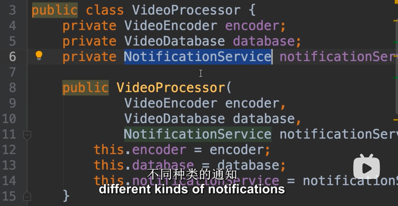
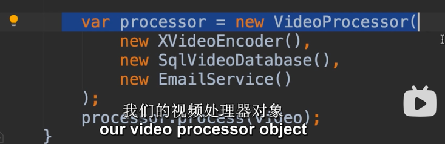
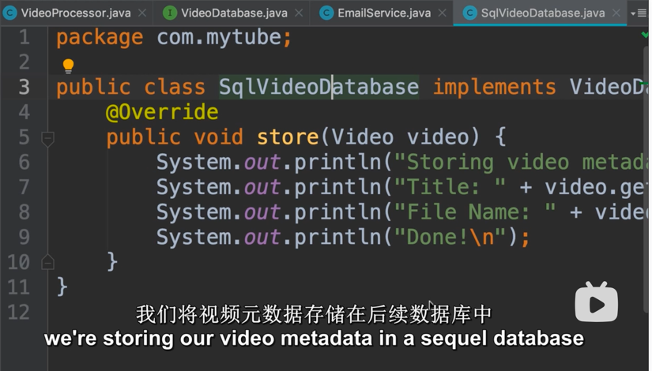

在这里，最重要的是理解 注入injection 是个什么鬼。


注入，可以理解为实现接口的具体类，把那个类绑定到接口中，然后，那个具体的实现类里的算法才是真正执行的东西。

注入方法有constructor，setter等

如果有很多个方法需要实现这个接口所规定的功能，那么可能需要一个注入框架。


# 逻辑：

在main类里
```java
var calculator = new TaxCalculator2018(100_000);
```
这个calculator 调用了 TaxCalculator2018 的具体class


在TaxCalculator2018类里：
```java
    private double taxableIncome;

    public TaxCalculator2018(double taxableIncome) {
        this.taxableIncome = taxableIncome;
    }
    @Override
    public double calculateTax(){
        return taxableIncome * 0.4;
    }
```
规定了，TaxCalculator2018 传入的参数是 taxableIncome， 利用构造函数传递的。随后，在 calculateTax里做了具体的计算。


**整个过程相当于，calculator 绑定了 TaxCalculator2018 作为实现 TaxCalculator 的类**

**更常见的是**
```java
var calculator = new TaxCalculator (new TaxCalculator2018(),new TaxCalculator2019());
```
这意味着，TaxCalculator 中的构造函数，可能有两个部分需要初始化，一个为a，一个为b。
这时，TaxCalculator 绑定了 TaxCalculator2018 和 TaxCalculator2019 两个类来实现它的内容。
这两个类作为实现a的具体类，并且它们还可能调用了各自的接口。


如下所示：
VideoProcessor 需要三个玩意实现它，一个是encoder，一个是database，一个是 notificationServer



在主函数里，VideoProcessor 通过绑定 XVideoEncoder() SqlVideoDatabase() EmailService() 三个具体的类来实现 processor
这个过程叫做 **injection 注入** 。


SqlVideoDatabase 中有它实现的细节。



